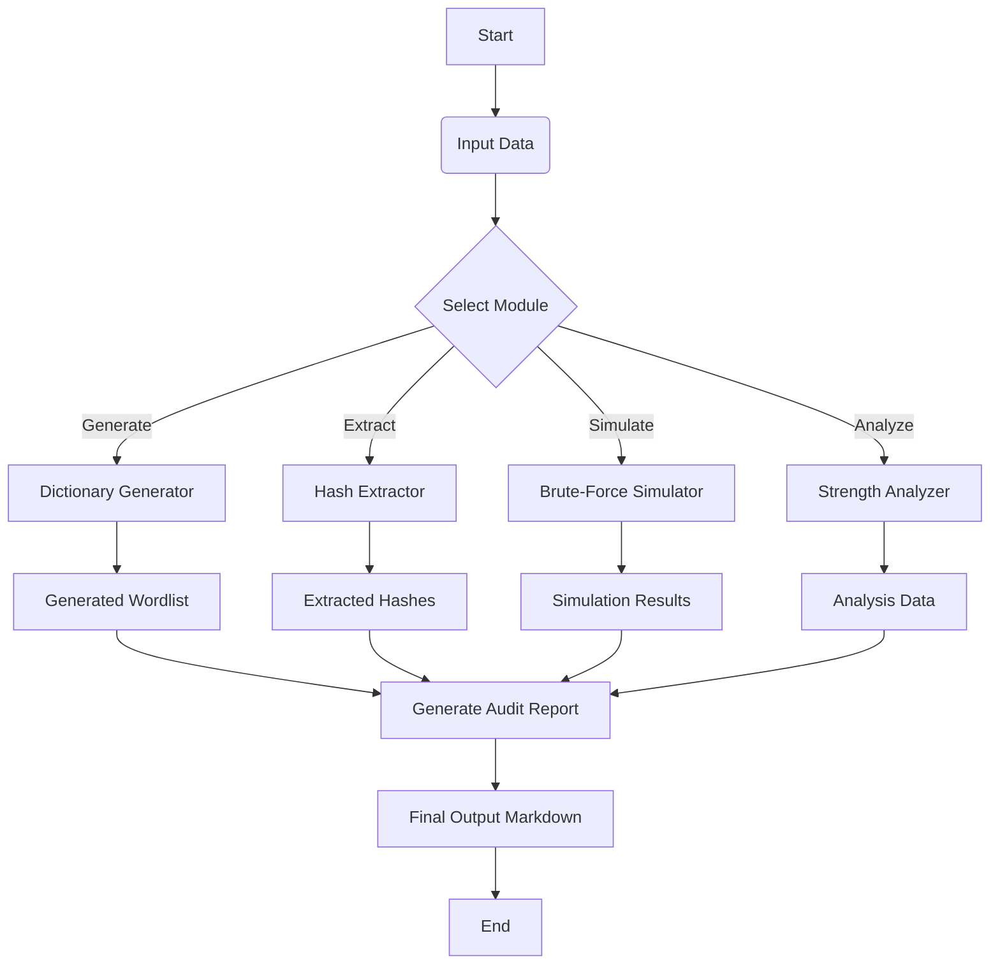

# Password Cracking & Credential Attack Suite

## Overview
This project focuses on designing and developing a practical toolkit for password policy testing and credential security assessment. It provides an ethical, controlled environment to understand how password cracking works, how credentials are stored, and how security teams can reinforce authentication mechanisms.

## Included Modules
1. **Dictionary generator:** Generates custom wordlists based on patterns and mutation rules.
2. **Hash extraction:** Extracts Linux shadow files and Windows SAM database (demonstrative simulated extraction).
3. **Brute-force simulation module:** Simulates brute-force cracking and estimates time-to-crack.
4. **Password strength analyzer:** Analyzes complexity, entropy, and identifies weaknesses.
5. **Report generator:** Generates detailed Markdown audit reports.

## Web Application UI
The toolkit has been packaged into a modern, professional Flask-based web interface to allow for easy demonstration.

### Installation
```bash
pip install -r requirements.txt
```

### Running the Toolkit
To launch the Web UI:
```bash
python webapp.py
```
Then navigate to `http://127.0.0.1:5000/`

To use the interactive CLI menu:
```bash
python main.py --interactive
```

## Architecture Flowchart



## Built With
- Python 3
- Flask
- Tailwind CSS
- Zxcvbn
- Passlib

## Disclaimer
This tool is built for ethical, educational security assessments in controlled environments.
